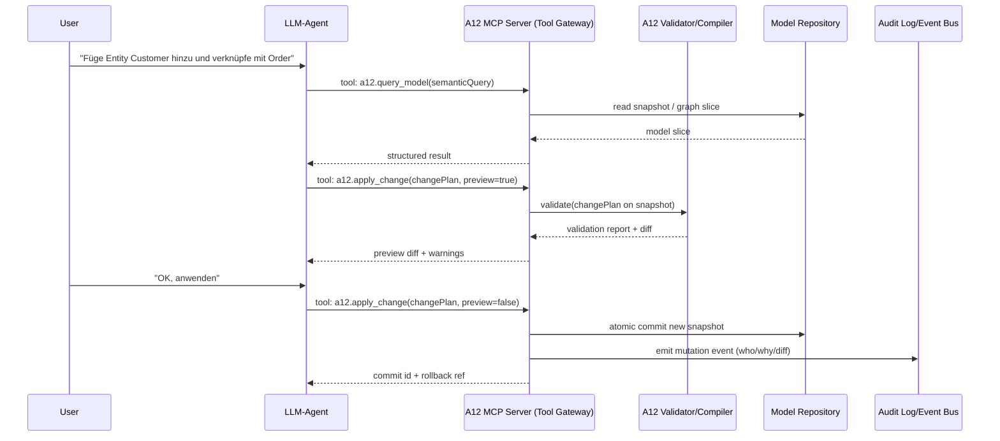
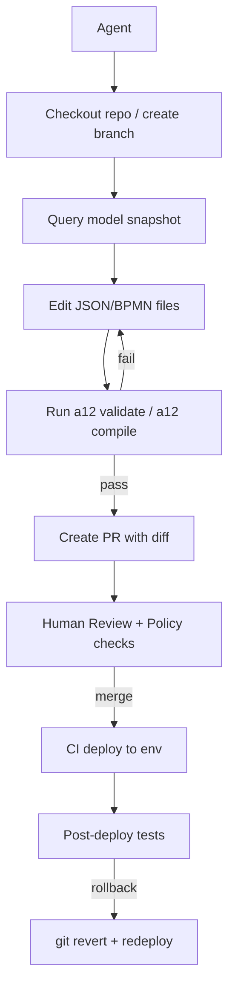
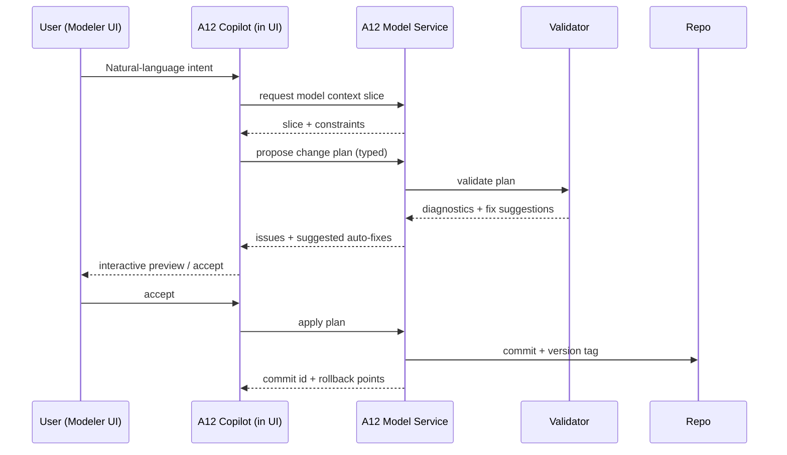

# AI-Agenten für Modellabfrage und Modelländerung in Design-, Prozess- und Low-Code-Tools


## Executive Summary


Der Stand der Technik hat sich 2024–2026 spürbar von „Chatbots *über* Modelle“ hin zu „Agenten *mit Werkzeugzugriff* auf Modelle“ verschoben. Der wichtigste Trend ist dabei die Standardisierung/Produktisierung von Tool-Zugriffen über **MCP (Model Context Protocol)**: Figma stellt einen **Figma MCP Server** bereit (remote und desktop), der strukturierte Design‑Kontexte, Metadaten und ausgewählte Schreiboperationen (z. B. Code‑Connect‑Mappings, Diagramm‑Generierung) als Tools anbietet. [1](https://developers.figma.com/docs/figma-mcp-server/tools-and-prompts/) Parallel dazu wird MCP in Agent‑Plattformen „first class“ (z. B. in OpenAI[2](https://developer.salesforce.com/docs/ai/agentforce/guide/agent-dx-manage.html)‑Dokumentation: „Connectors and MCP servers“; tool calling und Agent‑SDK‑Traces). [3](https://developers.openai.com/api/docs/guides/tools-connectors-mcp/)

Für **modellbasierte Low‑Code‑Plattformen** ist besonders relevant, dass mehrere Anbieter inzwischen **programmatische Schreibpfade** in ihre Modell‑Stacks bringen:
 *Mendix* *bietet mit Platform+Model SDKs explizit „Read/Write“ auf Metamodel‑Elemente, inklusive Working Copies und Commit ins Repository – mit dem klaren Hinweis, dass man Modelle auch invalid machen kann.** *[4](https://docs.mendix.com/apidocs-mxsdk/mxsdk/sdk-intro/)* **Zusätzlich integriert Mendix „Maia Make“ als In‑IDE‑AI und erwähnt ausdrücklich einen* *MCP Client, der Maia mit beliebigen MCP‑Servern verbinden kann.** *[5](https://www.mendix.com/blog/mendix-release-11-8/)
 **Salesforce** behandelt Agenten selbst als **Metadata‑Komposition** (AiAuthoringBundle, Bot/BotVersion, GenAiPlannerBundle, GenAiFunction …) und liefert mit **Agentforce DX** CLI/VS‑Code‑Workflows (Agent Spec YAML, Aktivieren/Deaktivieren). [6](https://developer.salesforce.com/docs/ai/agentforce/guide/agent-dx-metadata.html)
 *Camunda* *bietet für Modell‑Artefakte (BPMN/DMN/Forms) eine* *Web Modeler REST API* *(JWT, Rate Limit in SaaS) sowie „Play mode“ zur Validierung innerhalb des Modelers; gleichzeitig wird „zbctl“ als offizieller CLI‑Pfad ab 8.6 faktisch zurückgestuft zugunsten eines vereinheitlichten REST‑API‑Pfads.** *[7](https://docs.camunda.io/docs/apis-tools/web-modeler-api/overview/)
 **Figma** ergänzt neben MCP auch REST‑Schreibendpunkte für Teilmodelle wie **Variables** (bulk create/update/delete in definierter Reihenfolge) und **Dev Resources**. [8](https://developers.figma.com/docs/rest-api/variables-endpoints/)

Für eure A12‑Plattform (modellbasierte App‑Entwicklung) lassen sich daraus drei robuste Architektur‑Optionen ableiten:
1) **Transaktionales „Model Command Gateway“ als MCP‑Server** (tool‑basiert, typed, diff/preview, policy‑gesteuert),
2) **GitOps‑/PR‑Workflow „Model as Code“** (Agent arbeitet in Branches, CI validiert, Merge als Gate),
3) **In‑Modeler Copilot/Plugin** (Agent nahe an GUI‑Semantik, aber serverseitig abgesichert). (Details inkl. Sequenzdiagrammen weiter unten.)

Die Kern‑Trade‑offs sind: **Latenz vs. Kontrollierbarkeit**, **freie Modellmanipulation vs. Garantien/Validität**, **GUI‑Produktivität vs. Merge‑/Audit‑Qualität**. Forschung zu grafischen vs. textuellen Repräsentationen zeigt konsistent, dass grafische Artefakte in Kommunikation/Recall Vorteile haben können, während die Effekte kontextabhängig bleiben; konkrete Experimente berichten signifikante Unterschiede je nach Aufgabe/Notation. [9](https://www.se-rwth.de/publications/Software-engineering-whispers-The-effect-of-textual-vs-graphical-software-design-descriptions-on-software-design-communication.pdf)

## Markt- und Technologiestand


### Design-/UI-Modellierung


**Figma MCP Server (beta → produktisiert, remote/desktop):** Der Server stellt Tools bereit, um Design‑Kontext (Layer/Selection), Variablen/Styles, Metadaten, Screenshots sowie FigJam‑XML/Diagramm‑Generierung bereitzustellen; zudem existieren Schreib‑Tools wie add_code_connect_map und generate_diagram. [10](https://developers.figma.com/docs/figma-mcp-server/tools-and-prompts/) Der remote Server ist als gehosteter Endpoint nutzbar (in Figma‑Doku wird explizit ein MCP‑Endpoint genannt), und Figma beschreibt „Skills“ als agent‑seitige Anleitungen zur Tool‑Sequenzierung. [11](https://help.figma.com/hc/en-us/articles/32132100833559-Guide-to-the-Figma-MCP-server)

**REST/Plugin als zweiter Pfad:** Der Figma REST‑Stack unterstützt nicht nur Lesen, sondern für bestimmte Modellteile auch Schreiben (u. a. Variables bulk POST; Dev Resources CRUD; Comments POST/DELETE; Webhooks). [12](https://developers.figma.com/docs/rest-api/variables-endpoints/) Figma liefert außerdem Version‑History Endpoints (GET versions) und Typen, die explizit „view, track and restore previous versions“ beschreiben – relevant für Rollback/Provenienz. [13](https://developers.figma.com/docs/rest-api/version-history-endpoints/)

### Prozessmodellierung und Orchestrierung


**Camunda Web Modeler API (REST):** Camunda dokumentiert eine Web Modeler REST API (/api/*) mit JWT‑Auth, OpenAPI/Swagger und klarer SaaS‑Rate‑Limitierung (240 req/min). Wichtig: In den Usage Notes wird betont, dass das Löschen über API **nicht rückgängig** gemacht werden kann („deletion cannot be undone“) – das ist ein zentraler Unterschied zu Repository‑basierten Workflows. [14](https://docs.camunda.io/docs/apis-tools/web-modeler-api/overview/)

**Validierung/Simulation in der Modellierungsumgebung:** „Play mode“ ist ein „Zeebe‑powered playground“ in Web Modeler, um Prozesse „at any stage“ zu validieren und zu debuggen. [15](https://docs.camunda.io/docs/components/modeler/web-modeler/collaboration/play-your-process/)

**CLI und Shift Richtung REST:** zbctl existiert als CLI‑Tool für Deploy/Jobs/Status, wird aber ab Camunda 8.6 nicht mehr als offiziell weiterentwickelter Feature‑Carrier positioniert; Camunda begründet das u. a. mit Fokus auf REST API und OpenAPI/Postman. [16](https://unsupported.docs.camunda.io/8.5/docs/apis-tools/cli-client/)

**AI in der Modellierung:** Camunda positioniert „Copilot“ als Hilfe beim Prototyping/Validieren/Verbessern von Prozessmodellen und bei ausführbarer Logik (z. B. FEEL‑Bezug in Preview‑Blogpost). [17](https://camunda.com/blog/2025/05/camunda-88-preview-feel-capabilities-copilot/) (Das ist wichtig als Referenz, wie Vendor‑AI in Modeler‑UX eingebettet wird.)

### Low-Code Plattformen


**Salesforce (Modelle als Metadata + AI‑Agenten als Metadata‑Komposition):** Agentforce DX beschreibt Agenten als Sammlung aus mehreren Metadata‑Komponenten; AiAuthoringBundle besteht aus einer klassischen Metadata‑XML plus einer .agent‑Quelle in einer „Agent Script language“. [18](https://developer.salesforce.com/docs/ai/agentforce/guide/agent-dx-metadata.html) Agent Spec Files sind YAML, enthalten Agent‑Eigenschaften und eine LLM‑generierte Topic‑Liste; Iteration erfolgt durch erneutes Generieren mit verfeinerten Beschreibungen. [19](https://developer.salesforce.com/docs/ai/agentforce/guide/agent-dx-generate-agent-spec.html) Für Operations an Agenten ist das Aktivieren/Deaktivieren über VS Code oder CLI dokumentiert (Agent muss für gewisse Funktionen aktiv sein; Änderungen erfordern Deaktivieren). [20](https://developer.salesforce.com/docs/ai/agentforce/guide/agent-dx-manage.html)

**Mendix (explizite Modell‑APIs + In‑IDE AI):** Mendix SDKs sind explizit auf „Read“ und „Write“ am App‑Metamodell ausgelegt (Domain Models, Microflows, Pages, Security usw.), mit Warnhinweisen, dass bestimmte Bereiche leicht invalid werden können. [21](https://docs.mendix.com/apidocs-mxsdk/mxsdk/sdk-intro/) Die Platform‑SDK abstrahiert Repository/Working Copies und Commits. [22](https://apidocs.rnd.mendix.com/platformsdk/latest/classes/onlineworkingcopy.html) Mendix „Maia“ wird als AI‑Assistenz für schnelleres Modellieren beschrieben, inklusive Zusicherung, dass Maia keine Kundendaten für Training nutzt und auf „off‑the‑shelf“ LLMs basiert. [23](https://docs.mendix.com/refguide/mendix-ai-assistance/) In Release‑Kommunikation wird „Maia Make“ als Chat‑Interface in Studio Pro beschrieben und explizit um einen **MCP Client** erweitert („connect Maia to any MCP server …“). [5](https://www.mendix.com/blog/mendix-release-11-8/)

## Modelloperationen, die AI-Agenten heute praktisch ausführen


Im Use‑Case „Agent fragt Modelle ab und modifiziert sie“ lohnt eine **Operations‑Taxonomie**, weil sich daraus API‑Design, Tool‑Schnittstellen und Transaktions-/Audit‑Mechaniken ableiten lassen.

### Operations-Set und typische Realisierung


| Operation | Ziel im Modellkontext | Typische technische Umsetzung | Beispiele (Vendor) |
| --- | --- | --- | --- |
| Read / Query | Navigieren/Filtern (IDs, Knoten, Properties, Referenzen) | REST GET, MCP Tool get_*, SDK Queries, Export | Figma get_design_context, get_metadata [24](https://developers.figma.com/docs/figma-mcp-server/tools-and-prompts/); Camunda Web Modeler API Read [25](https://docs.camunda.io/docs/apis-tools/web-modeler-api/overview/); Mendix openModel() + Finder [26](https://docs.mendix.com/apidocs-mxsdk/mxsdk/finding-things-in-the-model/) |
| Transform | Semantikänderung (z. B. BPMN‑Pattern, Normalisierung, Token‑Renames) | SDK‑Mutation, JSON/XML Patch, „Command“‑API | Figma Variables bulk UPDATE/DELETE [27](https://developers.figma.com/docs/rest-api/variables-endpoints/); Mendix Model SDK „write“ auf Metamodel‑Elemente [21](https://docs.mendix.com/apidocs-mxsdk/mxsdk/sdk-intro/) |
| Validate | Konsistenz/Well‑formedness/Policies | Server‑Validator, Linter, Schema‑Checks, „dry‑run“ Deploy | Camunda Play (Validierung im Modeler) [15](https://docs.camunda.io/docs/components/modeler/web-modeler/collaboration/play-your-process/); Zeebe/GRPC: invalid resource Kriterien [28](https://unsupported.docs.camunda.io/8.1/docs/apis-tools/grpc/) |
| Refactor | Strukturelle Umbauten ohne Funktionsänderung | Graph‑Rewrites + Referenz‑Update | Mendix: möglich, aber Risiko „invalid model“ [29](https://docs.mendix.com/apidocs-mxsdk/mxsdk/sdk-intro/) |
| Generate / Codegen | Code, Konfiguration, Tests, Doku aus Modell | MCP/SDK, Template‑Engines, Build‑Pipelines | Figma MCP: Design‑Kontext → Code‑Workflow; create_design_system_rules [24](https://developers.figma.com/docs/figma-mcp-server/tools-and-prompts/); Salesforce Agentforce DX: Spec → Bundles/Metadata [30](https://developer.salesforce.com/docs/ai/agentforce/guide/agent-dx-generate-agent-spec.html) |
| Simulate / Execute | Laufzeit‑Semantik prüfen (Tokens, Datenpfade) | Sandbox‑Runtime, Play/Test Runner | Camunda Play mode [31](https://docs.camunda.io/docs/components/modeler/web-modeler/collaboration/play-your-process/); Salesforce Flow Debugger/Tests [32](https://help.salesforce.com/s/articleView?id=platform.flow_test_debug.htm&language=en_US&type=5); Mendix Microflow Debugging [33](https://docs.mendix.com/refguide/microflows/) |
| Merge / Conflict Resolution | Paralleländerungen konsolidieren | Git merge + domain‑aware merge drivers | Mendix Merge‑Algorithmus + mx merge + #Conflicts Markierung [34](https://docs.mendix.com/refguide/merge-algorithm/) |
| Provenance | „Wer/Warum/Wie“ (inkl. Agent‑Kontext) | Audit Logs, Event Streams, Version History | Salesforce Setup Audit Trail [35](https://developer.salesforce.com/docs/atlas.en-us.securityImplGuide.meta/securityImplGuide/admin_monitorsetup.htm); Figma Discovery API inkl. AI Prompts + Comments [36](https://developers.figma.com/docs/rest-api/discovery/) |
| Rollback | Zurück auf vorherigen Zustand | Version History restore, Git revert, rollbackOnError | Figma Version History „restore“ (Konzept) [37](https://developers.figma.com/docs/rest-api/version-history-types/); Salesforce rollbackOnError in DeployOptions [38](https://developer.salesforce.com/docs/atlas.en-us.api_meta.meta/api_meta/meta_deploy.htm) |


### Konkrete API/SDK/CLI-Beispiele für Query und Modify


#### Figma: Variables bulk create/update/delete via REST


Figma dokumentiert POST /v1/files/:file_key/variables als Bulk‑Operation, die create/update/delete in definierter Reihenfolge annimmt. [39](https://developers.figma.com/docs/rest-api/variables-endpoints/)

```bash
# (Beispiel) Neue Variable Collection anlegen
curl -X POST "https://api.figma.com/v1/files/<FILE_KEY>/variables" \
  -H "Authorization: Bearer $FIGMA_TOKEN" \
  -H "Content-Type: application/json" \
  -d '{
    "variableCollections": [
      { "action": "CREATE", "name": "Example variable collection" }
    ]
  }'
```json
{
  "variableCollections": [
    { "action": "CREATE", "name": "Example variable collection" }
  ],
  "variables": [
    {
      "action": "CREATE",
      "name": "color.brand.primary",
      "variableCollectionId": "<TEMP_OR_EXISTING_COLLECTION_ID>",
      "resolvedType": "COLOR"
    }
  ]
}
```


*Agentisches Muster:* Ein Agent kann zuerst über MCP/REST Variablen enumerieren (GET local variables) und dann mit einer einzigen Bulk‑Mutation konsistente Token‑Änderungen durchführen (z. B. Rename + Value Change in mehreren Modes), statt hunderte UI‑Clicks. [40](https://developers.figma.com/docs/rest-api/variables-endpoints/)

#### Camunda: BPMN deploy/test über CLI und Play


zbctl ist als CLI dokumentiert für Deploy/Status/Instanzen. [41](https://unsupported.docs.camunda.io/8.5/docs/apis-tools/cli-client/) Gleichzeitig empfiehlt Camunda strategisch den Shift zur REST‑API; zbctl wird ab 8.6 nur community‑maintained weitergeführt. [42](https://camunda.com/blog/2024/09/deprecating-zbctl-and-go-clients/)

```bash
# Deploy BPMN
zbctl deploy resource order-process.bpmn

# (typisch) Cluster Status prüfen
zbctl status
```


Für die Validierung in der Modellierungsumgebung existiert „Play mode“ als Sandbox‑Validierung in Web Modeler. [15](https://docs.camunda.io/docs/components/modeler/web-modeler/collaboration/play-your-process/)

*Agentisches Muster:* Agent erzeugt/editiert BPMN (XML) → deploy in Dev‑Cluster → startet Testinstanzen → prüft Incidents/Fehler → iteriert. Dass Deploys bei invaliden Ressourcen abgelehnt werden (z. B. broken XML oder semantisch invalid) ist in Zeebe‑API‑Dokumentation für INVALID_ARGUMENT‑Fälle beschrieben. [28](https://unsupported.docs.camunda.io/8.1/docs/apis-tools/grpc/)

#### Salesforce: Agentforce DX (Agenten) und Flow (Prozess-/Automation-Modelle)


Agentforce DX behandelt Agenten als versionierbares Source‑Bundle (AiAuthoringBundle + .agent), generiert werden kann ein YAML‑Agent‑Spec, dessen Topics LLM‑generiert sind. [43](https://developer.salesforce.com/docs/ai/agentforce/guide/agent-dx-metadata.html)

```bash
# (Beispiel) Agent Spec generieren (interaktiv; YAML entsteht in specs/)
sf agent generate agent-spec

# Agent aktivieren/deaktivieren (für Änderungen i. d. R. deaktivieren)
sf agent deactivate --api-name <AGENT_API_NAME>
sf agent activate   --api-name <AGENT_API_NAME>
```


Die Aktivierungs-/Deaktivierungslogik (Änderungen erfordern Deaktivieren) ist in der Agentforce‑DX‑Doku beschrieben. [20](https://developer.salesforce.com/docs/ai/agentforce/guide/agent-dx-manage.html)

Für Flow‑Modelle ist relevant, dass Flow/FlowDefinition als Metadata existieren, inkl. Versionierungsaspekten (FlowDefinition repräsentiert u. a. aktive Version; Flow‑Type beschreibt Deploy/Retrieve von Versionen). [44](https://developer.salesforce.com/docs/atlas.en-us.api_meta.meta/api_meta/meta_flowdefinition.htm)

*Agentisches Muster:* Agent retrieved Flow‑XML (CLI/Metadata API), führt textuelle Transform (z. B. Rename von Ressourcen, Einfügen eines Decision‑Branches), validiert in Sandbox per Flow Debugger/Flow Tests. [32](https://help.salesforce.com/s/articleView?id=platform.flow_test_debug.htm&language=en_US&type=5)

#### Mendix: Model SDK Write + Repository Commit


Mendix beschreibt explizit: Working Copy öffnen → Modell mutieren → model.flushChanges() → commitToRepository(). [45](https://docs.mendix.com/apidocs-mxsdk/mxsdk/creating-your-first-script/)

```typescript
import { domainmodels } from "mendixmodelsdk";
import { MendixPlatformClient } from "mendixplatformsdk";

async function main() {
  const client = new MendixPlatformClient();
  const app = await client.getApp("<APP_ID>");
  const wc = await app.createTemporaryWorkingCopy("main");
  const model = await wc.openModel();

  const dmIface = model.allDomainModels().find(dm => dm.containerAsModule.name === "MyFirstModule");
  const dm = await dmIface!.load();

  const entity = domainmodels.Entity.createIn(dm);
  entity.name = "Customer";

  await model.flushChanges();
  await wc.commitToRepository("main", { commitMessage: "Add Customer entity" });
}
main().catch(console.error);
```


Die SDK‑Einführung macht klar, dass dies „full read‑write access“ ist und man Modelle invalid machen kann; Mendix stellt deshalb u. a. Reverse‑Engineering‑Hilfen bereit und dokumentiert Troubleshooting für „invalid format“ nach Model‑SDK‑Edits. [46](https://docs.mendix.com/apidocs-mxsdk/mxsdk/sdk-intro/)

## Integrationsmuster für Agenten: MCP, APIs, SDKs, CLI/Git und Agent-as-a-Service


### MCP als „Model-Controller-Proxy“ im Sinne eines Tool-Gateways


**Praktische Beobachtung aus dem Markt:**
*Figma liefert MCP als Server‑Produkt (remote/desktop) mit konkreten Tools.** *[10](https://developers.figma.com/docs/figma-mcp-server/tools-and-prompts/)
 Mendix integriert MCP explizit als Client‑Fähigkeit in „Maia Make“. [5](https://www.mendix.com/blog/mendix-release-11-8/)
* OpenAI dokumentiert MCP‑Server/Connectors als Tools in der Responses‑/Agent‑Toolchain. [47](https://developers.openai.com/api/docs/guides/tools-connectors-mcp/)

**Warum MCP für Modell‑Systeme attraktiv ist:** MCP zwingt (wenn gut implementiert) zu einem **Tool‑Katalog** mit klaren Inputs/Outputs und kann dadurch ein *Policy‑Durchsetzungspunkt* werden. Der zentrale Architekturpunkt ist: Das LLM darf **nicht** „freies Schreiben“ in eure Modelldatenbank, sondern ruft **domänenspezifische Modell‑Commands** auf (create entity, rename attribute, move node, …), die serverseitig validieren und auditiert werden.

### REST/GraphQL direkt auf Model-Repositories


Direkte HTTP‑APIs sind der klassische Weg und in vielen Modell‑Stacks präsent (Figma REST, Camunda Web Modeler API, Salesforce Metadata/Tooling APIs, Mendix Platform APIs). [48](https://developers.figma.com/docs/rest-api/discovery/)
Für Agenten ist der kritische Unterschied: Ohne Tool‑Gateways neigen LLMs zu **zu granularen** oder **nicht idempotenten** Writes (z. B. „PATCH 20 Felder nacheinander“), was Latenz, Rate‑Limits und Konsistenz verschlechtert.

### Language-specific SDKs als „Typed Mutation Layer“


Mendix ist hier state‑of‑the‑art: platform+model SDKs bieten type‑sichere Mutation auf Metamodel‑Objekten, inklusive Commit‑Semantik. [49](https://docs.mendix.com/apidocs-mxsdk/mxsdk/sdk-intro/) Auch Camunda stellt TypeScript‑SDKs rund um REST‑APIs bereit (z. B. Orchestration Cluster TS SDK). [50](https://camunda.github.io/orchestration-cluster-api-js/)
SDKs sind besonders geeignet, wenn ihr **komplexe Invarianten** habt (Referenzen, IDs, Layout‑Koordinaten, Constraints). Der Agent kann dann *Tool‑Call → SDK‑Mutation → Validator → Commit* abbilden.

### CLI-basierte Workflows (Terminal-first, agent-friendly)


CLI ist für agentische Systeme oft der schnellste Integrationspfad, weil „Tool = Kommando“ und Output/Exit Codes gut maschinenlesbar sind. Beispiele: * Camunda: zbctl (auch wenn strategisch zurückgefahren). [16](https://unsupported.docs.camunda.io/8.5/docs/apis-tools/cli-client/)
*Salesforce: sf**‑CLI und Agentforce‑Plugin (Command Specs sind in Plugin‑Repo dokumentiert).** *[51](https://github.com/salesforcecli/plugin-agent)
 Mendix: mx merge als Merge‑Driver für .mpr, mit definierten Return Codes und anschließender Konfliktlösung in Studio Pro. [52](https://docs.mendix.com/refguide/mx-command-line-tool/merge/)

### Git-basierte „Model as Code“ und GitOps


Für deklarative Artefakte (JSON, YAML, BPMN XML, Salesforce metadata XML) ist Git/GitOps ein robustes Pattern, weil es versioniert, reviewbar und auditierbar ist. Als Referenz beschreibt Cloud Native Computing Foundation[53](https://www.mendix.com/blog/mendix-release-11-8/) GitOps‑Prinzipien (declarative, versioned state, automated reconciliation). [54](https://www.cncf.io/blog/2022/08/10/add-gitops-without-throwing-out-your-ci-tools/)
Für proprietäre/binary Modelle (klassisch: Mendix .mpr) braucht ihr domain‑aware merge/diff (siehe Mendix Merge‑Tooling). [55](https://docs.mendix.com/refguide/mx-command-line-tool/merge/)

### RAG + Vector DB als „Lesepfad“ für Modellwissen


RAG ist primär ein **Read‑Amplifier**: Modelle/Docs/Logs werden indiziert, Agent holt Kontext nach. Das NeurIPS‑Paper zu Retrieval‑Augmented Generation begründet den Nutzen: Zugriff auf „explicit non‑parametric memory“ verbessert Faktizität/Provenienzfähigkeit gegenüber rein parametrischem Wissen. [56](https://proceedings.neurips.cc/paper/2020/file/6b493230205f780e1bc26945df7481e5-Paper.pdf)
Für Modell‑Artefakte bedeutet das praktisch:
*Serialisierung von Graph‑Strukturen (z. B. „sparse XML“, JSON‑AST, BPMN element inventory),*
 Chunking nach Subgraphen/Komponenten,
* Retrieval plus Tool‑Calls, um Änderungen zu planen.

### Vergleichstabelle Integrationsmuster


| Muster | Stärken | Schwächen/Risiken | Geeignet wenn… |
| --- | --- | --- | --- |
| MCP Tool Gateway | Einheitlicher Tool‑Katalog, gute Policy‑Kontrolle, agent‑kompatibel, weniger Prompt‑Glue‑Code; MCP‑Tools sind in Agent‑Stacks (z. B. OpenAI) explizit vorgesehen [57](https://developers.openai.com/api/docs/guides/tools-connectors-mcp/) | Sicherheits-/Auth‑Komplexität (OAuth, token audience binding), Tool‑Scope Design entscheidend [58](https://modelcontextprotocol.io/specification/2025-06-18/basic/authorization) | Ihr einen stabilen, kontrollierten „Model Command“‑Layer wollt |
| Direkte REST/GraphQL | Einfach, etabliert, vendor‑nativ | Höhere Granularität, Rate‑Limits, schwerere Transaktions-/Audit‑Semantik | Modelländerungen bereits serverseitig transaktional/validierend gekapselt sind |
| SDK (typed) | Typ-/Invarianten-Sicherheit, bessere Refactorability | SDK‑Upgrades/Versioning, Risiko invalid models bei falscher Nutzung (Mendix warnt explizit) [29](https://docs.mendix.com/apidocs-mxsdk/mxsdk/sdk-intro/) | Metamodell komplex ist und starke Konsistenz nötig ist |
| CLI + Git Branch/PR | Audit/Review „out of the box“, Rolling back via revert, CI‑Validierung | Für binary/proprietär diff/merge schwierig; CLI‑Pfad kann vendor‑strategisch wechseln (Camunda zbctl) [59](https://camunda.com/blog/2024/09/deprecating-zbctl-and-go-clients/) | Ihr „Software‑Engineering‑Governance“ priorisiert |
| Agent-as-a-Service | Zentralisierte Governance, Observability, Secrets | Mehr Latenz, Multi‑Tenant‑Security, Datenhoheit | Viele Clients/Teams auf denselben Agent‑Service zugreifen sollen |


## Bewertung nach Latenz, Sicherheit, Zugriffskontrolle, Transaktionen, Observability und Audit


### Latenz und Skalierung


**MCP/Tool‑Gateways** senken oft die *effektive* Latenz, weil sie *weniger, dafür gröbere* Modelloperationen aufrufen („bulk update variables“, „apply refactor plan“) – statt Dutzende REST Writes. Figma zeigt Bulk‑Mutationen bei Variables, und Camunda setzt SaaS‑Rate Limits für Web Modeler API; beides sind Indikatoren, dass „Chatty APIs“ schnell limitierend werden. [60](https://developers.figma.com/docs/rest-api/variables-endpoints/)

**Figma REST Rate Limits** sind formal dokumentiert und seit Nov 2025 angepasst; die Mechanik (429 + Retry‑After etc.) wird beschrieben. [61](https://developers.figma.com/docs/rest-api/rate-limits/) In Community‑Feedback wird berichtet, dass Limits teils überraschend greifen (z. B. Images API). [62](https://forum.figma.com/report-a-problem-6/rest-api-rate-limit-images-api-returns-429-after-10-requests-cloudfront-49021) Für Agenten heißt das: aggressive Caching/Batching und webhook‑basiertes „Change detection“ statt Polling.

### Sicherheit und Access Control


**MCP Auth:** Der MCP Authorization‑Standard fordert für OAuth‑basierte Remote Server die Implementierung von **RFC 8707 Resource Indicators**, um Token an die intendierte Audience/Ressource zu binden. [58](https://modelcontextprotocol.io/specification/2025-06-18/basic/authorization) Das ist für „Agenten mit Schreibrechten“ zentral, weil sonst Token‑Misuse/Phishing‑Klassen möglich sind.

**Real-World Risiko:** Berichte über MCP‑Server‑Ökosystem‑Probleme (z. B. Sicherheitslücken in Git‑MCP‑Servern) zeigen, dass „Tool‑Access“ die Angriffsfläche real erweitert. [63](https://www.techradar.com/pro/security/anthropics-official-git-mcp-server-had-some-worrying-security-flaws-this-is-what-happened-next) Für A12 sollte daraus folgen:
*konsequente* *deny‑by‑default* *Tool‑Scopes,*
 serverseitige **Policy Engine** (RBAC/ABAC pro Modelloperation),
 *sandboxed execution* *für CLI/Code‑Tools,*
 Secrets nie im Prompt, nur im Tool‑Runtime.

### Transaktionale Garantien und Rollback


**Salesforce Metadata Deploy** dokumentiert explizit rollbackOnError in DeployOptions: bei true kompletter Rollback bei Fehler; bei false können Teilaktionen bestehen bleiben. [38](https://developer.salesforce.com/docs/atlas.en-us.api_meta.meta/api_meta/meta_deploy.htm) Das ist ein gutes Referenzdesign: jede agentische „Deploy Change“ Operation sollte einen deklarativen Transaktionsmodus haben (all‑or‑nothing vs partial).

**Mendix Working Copy + Commit:** Änderungen werden erst nach flushChanges() und commitToRepository() in den Repository‑Strang gebracht; damit habt ihr eine natürliche „staging → commit“ Transaktionsgrenze. [45](https://docs.mendix.com/apidocs-mxsdk/mxsdk/creating-your-first-script/)

**Camunda Deploy:** Zeebe APIs definieren invalid resource Bedingungen (u. a. broken XML, semantische Invalidität). Das wirkt wie ein serverseitiger Validator/Gate bei Deploy. [28](https://unsupported.docs.camunda.io/8.1/docs/apis-tools/grpc/)

**Figma Variables Bulk:** Die Doku beschreibt eine definierte Apply‑Reihenfolge innerhalb eines Requests; sie formuliert jedoch nicht explizit „all‑or‑nothing“. Für agentische Writes sollte man daher auf idempotente Bulk‑Designs + eindeutige Mapping‑Antworten (tempId→realId) setzen und bei Unsicherheit „dry‑run“/Preview‑Mechanik ergänzen. [27](https://developers.figma.com/docs/rest-api/variables-endpoints/)

### Observability und Auditability

- OpenAI[2](https://developer.salesforce.com/docs/ai/agentforce/guide/agent-dx-manage.html) beschreibt im Agents SDK explizit, dass ein Agent‑System Tool‑Nutzung orchestriert und „a full trace“ behalten kann – als Referenz für auditierbare Agent‑Runs. [64](https://developers.openai.com/api/docs/guides/agents-sdk/)
- Salesforce Setup Audit Trail protokolliert Setup-/Konfig‑Änderungen durch Admins – wichtig für „Model changes as configuration“. [35](https://developer.salesforce.com/docs/atlas.en-us.securityImplGuide.meta/securityImplGuide/admin_monitorsetup.htm)
- Figma Discovery API liefert Text‑Events inkl. „AI prompts“ sowie file comments; damit kann man agentische Änderungen (oder Prompt‑gestützte Änderungen) retrospektiv korrelieren. [36](https://developers.figma.com/docs/rest-api/discovery/)
- Mendix dokumentiert Logging‑Kategorien explizit bis hin zu MicroflowDebugger/MicroflowEngine. [65](https://docs.mendix.com/refguide/logging/)


**A12‑Designfolgerung:** „Auditability“ sollte nicht nachträglich als Logfile gedacht werden, sondern als **First‑Class Modell‑Provenienzobjekt**: jede Mutation erhält (a) Actor (User/Agent), (b) Tool/Command, (c) Input Hash, (d) Pre/Post Snapshot IDs, (e) Validator Ergebnis, (f) Deployment Correlation ID.

## Evidenz und Erfahrungen: Nutzerfeedback, Fallstudien und Forschung GUI+AI vs JSON/CLI


### Fallstudien und dokumentierte Nutzerpfade


**Figma:** Figma beschreibt den MCP‑Server als Brücke, um LLMs design‑informiert Code generieren zu lassen, und erweitert den Workflow bis hin zu „live UI capture“ als Design‑Layer. [66](https://www.figma.com/blog/introducing-figma-mcp-server/)

**Camunda:** Camunda positioniert Play als integrierte Validierung und zeigt AI‑Agent‑Beispiele, die innerhalb des Modeler‑Workflows getestet werden („Step through your model with Play“). [67](https://camunda.com/blog/2025/02/building-ai-agent-camunda/)

**Salesforce:** Agentforce DX beschreibt Agenten als Metadata‑first und liefert YAML‑/CLI‑Workflows; damit werden Agenten explizit in DevOps‑Prozesse integrierbar. [68](https://developer.salesforce.com/docs/ai/agentforce/guide/agent-dx-metadata.html)

**Mendix:** Mendix positioniert Maia als AI‑Assistenz im Modellieren, betont Datenschutz (keine Kundendaten fürs Training) und führt explizit MCP‑Connectivity in Maia Make ein. [69](https://docs.mendix.com/refguide/mendix-ai-assistance/)

### Community-Feedback und „Pain Points“


**Rate Limits & Agent‑Workflows (Figma):** REST‑Rate‑Limitierung ist dokumentiert; in Community‑/Issue‑Diskussionen treten 429/Retry‑After‑Probleme auf, die für agentische „looping“ retrievals kritisch sind. [70](https://developers.figma.com/docs/rest-api/rate-limits/)

**CLI/Metadata Reifegrad (Salesforce):** Ein GitHub Issue zeigt, dass das Retrieven von „Agent:\<Name>“ via sf project retrieve start in einem konkreten Fall in einen EPIPE‑Fehler nach minutenlanger Wartezeit läuft; das ist ein archetypisches Beispiel für „modellartige Artefakte sind neu, Tooling hinkt“. [71](https://github.com/forcedotcom/cli/issues/3405)

**Merge für proprietäre Modelle (Mendix):** Mendix adressiert Merge/Conflict explizit über mx merge und Studio Pro Konfliktlösung; Return Codes und Merge‑Driver‑Konzept werden dokumentiert. [55](https://docs.mendix.com/refguide/mx-command-line-tool/merge/) Das ist ein starkes Signal, dass „Git‑only für binary models“ nicht reicht.

**Safety bei SDK‑Writes (Mendix):** Mendix dokumentiert, dass Model SDK‑Edits das App‑Format invalid machen und Studio Pro das Projekt ggf. nicht mehr öffnen kann; dafür existieren Troubleshooting‑Guides. [72](https://docs.mendix.com/howto9/monitoring-troubleshooting/solving-load-and-import-errors/)

### Forschung: GUI/graphisch + AI vs JSON/CLI (textuell) – was lässt sich belastbar ableiten?


Direkte Studien „GUI+AI Agent vs JSON/CLI Agent“ sind (Stand heute) selten öffentlich als kontrollierte Experimente dokumentiert; die belastbarste Proxy‑Evidenz kommt aus Experimenten zu **grafischen vs textuellen Notationen** und aus empirischen Arbeiten zur Low‑Code‑Entwicklerleistung.

1) **Grafisch verbessert Kommunikation/Recall, wenn Menschen kollaborieren.** Ein großer Versuchsverbund („family of experiments“) mit 240 Teilnehmenden berichtet, dass grafische Designbeschreibungen aktives Diskutieren fördern und Recall von Design‑Details verbessern; zugleich kann ein „well‑organized text“ Recall verbessern, aber mit anderen Trade‑offs. [73](https://www.se-rwth.de/publications/Software-engineering-whispers-The-effect-of-textual-vs-graphical-software-design-descriptions-on-software-design-communication.pdf)
*Implikation für Agenten:* GUI+AI‑Assistenten im Modeler können besonders stark sein, wenn der Mensch‑Agent‑Loop kollaborativ ist (Review, gemeinsame Exploration) und visuelle Anker die Fehlinterpretation reduzieren.

2) **Notation beeinflusst Effizienz/Effektivität in Modellierungsaufgaben signifikant.** Eine empirische Studie zur Produktivität in Domain‑Modelling berichtet einen statistisch signifikanten Effekt des Notationstyps auf Effizienz/Effektivität, mit Befundrichtung zugunsten grafischer Notation für die betrachteten Aufgaben/Teilnehmenden. [74](https://scispace.com/pdf/impact-of-model-notations-on-the-productivity-of-domain-2f278keuj7.pdf)
*Implikation:* Für „Model editing by intent“ kann ein Agent, der GUI‑Semantik nutzt (z. B. „füge Entity und Association hier ein“), weniger Fehler produzieren als reines Text‑Patchen – **wenn** die Tool‑API die Semantik korrekt kapselt.

3) **Textuelle Artefakte sind überlegen bei Merge/Audit, aber nicht automatisch bei menschlicher Aufgabenleistung.** Mendix’ eigener Merge‑Stack zeigt, dass textbasierter Merge bei proprietären Modellen nicht trivial ist und domain‑aware Tooling erfordert. [55](https://docs.mendix.com/refguide/mx-command-line-tool/merge/)
*Implikation:* JSON/CLI‑Workflows gewinnen bei Automatisierung, Reproduzierbarkeit und Audit, verlieren aber ohne domänenspezifische Merge‑/Validierungslogik.

4) **Low-/No-Code Effizienz vs Experience (MODELS’24):** Eine empirische Studie (University of Kassel[75](https://www.se-rwth.de/publications/Software-engineering-whispers-The-effect-of-textual-vs-graphical-software-design-descriptions-on-software-design-communication.pdf)) berichtet in einem quantitativen Experiment, dass es keine signifikanten Unterschiede in Task‑Correctness oder Processing Time zwischen Programmierern und Citizen Developers in einem No‑Code‑Builder gab (für die untersuchten Aufgaben). [76](https://www.uni-kassel.de/eecs/index.php?eID=dumpFile&f=40025&t=f&token=b1a175d421589348da54f15ffb99610ac0d45cd4)
*Implikation:* Modell‑UI kann (für gewisse Aufgaben) die „Skill‑Gap“ reduzieren – was auch für human‑in‑the‑loop Agenten wichtig ist, wenn nicht nur Pro‑Devs Zielgruppe sind.

5) **LLM‑basierte Low‑Code Themen verschieben sich stark in Richtung Implementierungsphase.** Eine empirische Studie zu Traditional vs LLM‑based Low‑Code analysiert 7k+ posts als Ausgangsmenge und filtert auf relevante Datensätze; sie diskutiert u. a. LLM‑Agenten‑Integration und zeigt, dass Diskussionen über Implementierungsaufgaben in Q&A‑Foren dominieren. [77](https://nzjohng.github.io/publications/papers/jss2025_3.pdf)
*Implikation:* Agent‑Funktionen sollten nicht nur „Design‑Time“ (Generate Model) unterstützen, sondern vor allem „Implement‑Time“: Debuggability, Tests, Deployment‑Gates, Datenintegration.

**Konkrete Benchmark-Idee für A12 (ableitbar):**
Da Vendor‑Benchmarks selten sind, lohnt ein internes A/B‑Benchmarking: (a) Agent editiert A12‑Modelle über GUI‑nahe Commands vs (b) Agent editiert JSON‑Snapshots + CLI compile/validate. Messen: Zeit bis „green build“, Fehlerrate (invalid model / failed deploy), Merge‑Konflikte pro Änderung, Review‑Zeit.

## Empfohlene Architektur-Optionen für A12


Im Folgenden drei robuste Optionen, die sich direkt aus den Marktmechaniken ableiten. Ziel: „Agenten können A12‑Modelle abfragen und ändern“, ohne dass ihr Konsistenz, Security oder Audit verliert.

### Option: A12 MCP Model Command Gateway


**Kernidee:** A12 stellt einen MCP‑Server bereit, der **hochlevelige, domänenspezifische Tools** anbietet (keine generischen „write JSON“ Tools). Jeder Tool‑Call erzeugt serverseitig: Pre‑Snapshot → Mutation → Validation → Post‑Snapshot → Audit Event.

*Warum SOTA:* Figma zeigt, wie MCP‑Tools als produktisierte „Core server features“ katalogisiert werden. [10](https://developers.figma.com/docs/figma-mcp-server/tools-and-prompts/) OpenAI dokumentiert MCP‑Tooling als integriertes Agent‑Werkzeug. [57](https://developers.openai.com/api/docs/guides/tools-connectors-mcp/)




**Trade-offs:**
*Pro: Sehr gute Governance, tool‑level RBAC, einheitliche Observability; reduziert Prompt‑/Glue‑Komplexität.*
 Contra: MCP/Auth‑Komplexität (OAuth + Resource Indicators), Tool‑Design ist aufwendig. [58](https://modelcontextprotocol.io/specification/2025-06-18/basic/authorization)

### Option: A12 GitOps „Model as Code“ mit Agent in Branch/PR


**Kernidee:** A12‑Modelle haben eine (kanonisierte) textuelle Repräsentation (JSON/BPMN‑XML‑ähnlich). Agent arbeitet in Feature‑Branch, führt CLI‑Validierung aus, öffnet PR. Merge = Deployment Trigger.




**Warum SOTA:** Salesforce/Agentforce DX und klassische Metadata‑Workflows sind genau in diese Richtung gebaut (Agenten als versionierbare Artefakte). [43](https://developer.salesforce.com/docs/ai/agentforce/guide/agent-dx-metadata.html) GitOps‑Prinzipien sind etabliert (declarative, versioned state). [54](https://www.cncf.io/blog/2022/08/10/add-gitops-without-throwing-out-your-ci-tools/)

**Trade-offs:**
*Pro: Maximale Auditability/Review, gute Rollback Story (revert), skalierbar.*
 Contra: Für proprietäre/binary Modelle braucht ihr Merge‑Tooling (Mendix zeigt den Aufwand). [55](https://docs.mendix.com/refguide/mx-command-line-tool/merge/)

### Option: A12 In-Modeler Copilot mit serverseitigem Commit und Validator


**Kernidee:** Agent lebt „im“ GUI‑Modeler (ähnlich Mendix Maia Make, Camunda Copilot), führt aber *keine direkten Writes* aus. Stattdessen erzeugt er Change‑Plans, die serverseitig validiert/committed werden (wie Option 1, aber UI‑zentriert).




**Warum SOTA:** Mendix beschreibt Maia als AI‑Assistenz in Studio Pro und betont, dass Maia sogar App‑Teile generieren kann; Camunda beschreibt Copilot/Play‑basierte Validierung. [78](https://docs.mendix.com/refguide/mendix-ai-assistance/)

**Trade-offs:**
*Pro: Beste UX für exploratives Modellieren, weniger Kontextverlust, gute „Human-in-the-loop“‑Kontrolle.*
 Contra: Modeler‑Integration/Plugin‑API muss stabil sein; Camunda warnt z. B., dass Plugin API nicht stabil ist. [79](https://docs.camunda.io/docs/components/modeler/desktop-modeler/plugins/)

### Minimaler CLI+JSON Baustein für A12 (agent-driven query/modify)


Ein pragmatischer Start (auch als Fallback für alle Optionen):

```sql
# Query: alle Entities mit Attributen
a12 model query --format json \
  --select 'entities[*].{name:name, attributes:attributes[*].name}' > entities.json

# Agent (oder Skript) generiert Patch
cat > patch.json <<'JSON'
{
  "op": "add",
  "path": "/entities/-",
  "value": { "name": "Customer", "attributes": [{"name":"Email","type":"String"}] }
}
JSON

# Apply + Validate + Commit (transaktional)
a12 model apply --patch patch.json --validate --commit \
  --message "Add Customer entity (agent-assisted)"
```


*Wichtig:* Die Wertschöpfung entsteht nicht durch „JSON patch an sich“, sondern durch **A12‑seitige Garantien**: schema validation, referential integrity, deterministic IDs/layout, audit log, rollback pointers.

## Anhang mit priorisierten Quellen und Vertiefungsfragen


### Priorisierte Quellen (kuratiert)


**Offizielle Vendor-Dokumentation (höchste Priorität)**
Figma MCP Server Tools/Installationspfade/Capabilities [80](https://developers.figma.com/docs/figma-mcp-server/tools-and-prompts/)
Figma REST: Variables/Dev Resources/Rate Limits/Discovery/Version History [81](https://developers.figma.com/docs/rest-api/variables-endpoints/)
Camunda Web Modeler API + Limits/Undo‑Hinweis, Play mode, zbctl/REST‑Strategie [7](https://docs.camunda.io/docs/apis-tools/web-modeler-api/overview/)
Salesforce Agentforce DX (Agent Metadata, Agent Spec, Manage/Activate/Deactivate) [68](https://developer.salesforce.com/docs/ai/agentforce/guide/agent-dx-metadata.html)
Salesforce Metadata Deploy rollbackOnError [38](https://developer.salesforce.com/docs/atlas.en-us.api_meta.meta/api_meta/meta_deploy.htm)
Mendix SDK Intro/Working Copy Commit/„invalid model“ Troubleshooting, Maia Privacy/MCP Client [82](https://docs.mendix.com/apidocs-mxsdk/mxsdk/sdk-intro/)
Mendix Merge (mx merge, merge algorithm, #Conflicts) [55](https://docs.mendix.com/refguide/mx-command-line-tool/merge/)

**Originale Forschung / peer-reviewed (für GUI vs Text, Low-Code/LLM, RAG)**
Grafisch vs textuell in Design‑Kommunikation (family of experiments) [83](https://www.se-rwth.de/publications/Software-engineering-whispers-The-effect-of-textual-vs-graphical-software-design-descriptions-on-software-design-communication.pdf)
Notationseffekte auf Produktivität im Domain Modelling [84](https://scispace.com/pdf/impact-of-model-notations-on-the-productivity-of-domain-2f278keuj7.pdf)
Grafische vs textuelle Prozessbeschreibungen (experimentell; JSS) [85](https://research.wu.ac.at/ws/files/19821275/JSS11-description.pdf)
Low‑Code vs Developer Experience/Efficiency (MODELS Companion’24, University of Kassel[75](https://www.se-rwth.de/publications/Software-engineering-whispers-The-effect-of-textual-vs-graphical-software-design-descriptions-on-software-design-communication.pdf)) [86](https://www.uni-kassel.de/eecs/index.php?eID=dumpFile&f=40025&t=f&token=b1a175d421589348da54f15ffb99610ac0d45cd4)
RAG Grundlagendokument (NeurIPS 2020) [56](https://proceedings.neurips.cc/paper/2020/file/6b493230205f780e1bc26945df7481e5-Paper.pdf)
Empirische Studie zu traditional vs LLM‑based Low‑Code (SO‑Datenanalyse) [87](https://nzjohng.github.io/publications/papers/jss2025_3.pdf)

**Ökosystem/Standards & Security**
MCP OAuth/Resource Indicators + RFC 8707 [58](https://modelcontextprotocol.io/specification/2025-06-18/basic/authorization)
OpenAI Tool calling + MCP Connectors/Agents SDK [88](https://developers.openai.com/api/docs/guides/function-calling/)
Beobachtete Risiken im MCP‑Ökosystem (Supply‑Chain/Sicherheitslücken) [63](https://www.techradar.com/pro/security/anthropics-official-git-mcp-server-had-some-worrying-security-flaws-this-is-what-happened-next)

### Vertiefungsfragen


A. Welche **A12‑Modell‑Invarianten** (Referenzen, IDs, Layout, Constraints, Security) müssen *härter* garantiert werden: bei jeder Mutation oder erst vor Deploy?
B. Wie sollte eure **A12‑Tool-Semantik** aussehen: „Low‑level JSON Patch“ vs. „High‑level Model Commands“ (create entity, move node, refactor module)?
C. Welche **Transaktions- und Rollback-Semantik** braucht ihr: „rollbackOnError“ (all‑or‑nothing) vs. partial apply + kompensierende Aktionen? [38](https://developer.salesforce.com/docs/atlas.en-us.api_meta.meta/api_meta/meta_deploy.htm)
D. Wie wollt ihr **Merge & Conflict Resolution** für proprietäre/graphische Modelle lösen (MPR‑ähnlich) und welche Text‑/kanonische Repräsentation ist dafür nötig? [55](https://docs.mendix.com/refguide/mx-command-line-tool/merge/)
E. Welche **Security-Grenzen** setzt ihr für Agenten: MCP mit OAuth‑Resource‑Binding (RFC 8707), per‑Command RBAC/ABAC, Sandbox‑Execution, Secrets‑Handling? [89](https://modelcontextprotocol.io/specification/2025-06-18/basic/authorization)
