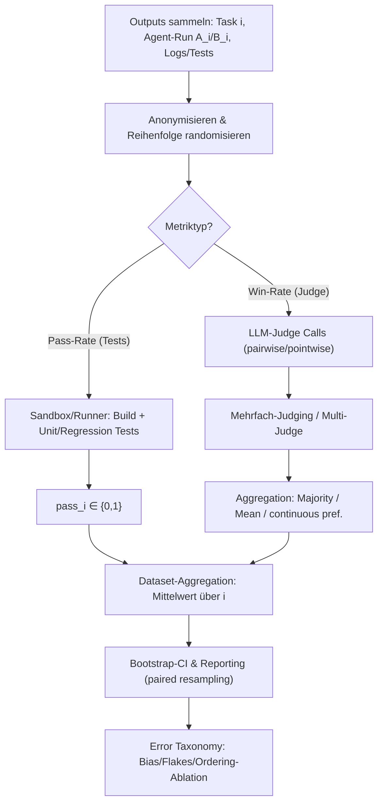

# LLM-as-a-Judge in Benchmarks für Coding‑Agenten


## Executive Summary


In Coding‑Benchmarks dominiert weiterhin **testbasierte Pass‑Rate** (Unit‑Tests/Integrationstests) als objektives Erfolgskriterium, während **LLM-as-a-Judge** vor allem dort eingesetzt wird, wo Tests fehlen, unvollständig sind oder wo zusätzliche Qualitätsdimensionen (Lesbarkeit, Patch‑Akzeptabilität, Teilschritte) bewertet werden sollen. Primärquellen zeigen jedoch, dass LLM‑Judging in Coding‑Kontexten **besonders anfällig für Positions‑/Format‑Effekte und Stochastik** ist und daher robuste Designs (Randomisierung, Mehrfach‑Judging, Abstention, Referenz-/Rubrik‑Guidance, CI‑Reporting) benötigt. [1](https://arxiv.org/pdf/2507.10535)

## Begriffe und konzeptionelle Unterscheidungen


### Definition: LLM-as-a-Judge im Coding‑Kontext


**LLM-as-a-Judge (Coding)** bezeichnet Evaluationsverfahren, in denen ein Language Model $J$ Code‑Outputs (z. B. generierte Funktionen, Patches, Test‑Suites, Agent‑Trajektorien) bewertet oder vergleicht, typischerweise über ein Prompt, das Aufgabe $p$, Kandidatenantwort(en) $r$ und Judge‑Instruktion $q$ kombiniert. **CodeJudgeBench** formalisiert das explizit als $J\leftarrow LLM\left(p⊕r⊕q\right)$ und unterscheidet pairwise vs. pointwise Varianten. [2](https://arxiv.org/pdf/2507.10535)

In Coding‑Szenarien wird LLM‑Judging in der Literatur typischerweise für zwei Zielklassen eingesetzt: - **Korrektheit ohne Ausführung** (execution‑free functional judging): „Ist der Code funktional korrekt?“ ohne Testausführung; hierfür werden „slow‑thinking“/Schritt‑für‑Schritt‑Analysen und strikte Output‑Schemas genutzt (z. B. **CODEJUDGE**). [3](https://aclanthology.org/2024.emnlp-main.1118.pdf)
- **Qualität/Präferenz** (readability/style/utility): Paarweise Präferenz „A besser als B“ oder Ranking nach Kriterien (Lesbarkeit, Klarheit, Effizienz, Robustheit) – häufig aus Chat-/Instruction‑Benchmarks (z. B. **MT‑Bench**, **AlpacaEval**), in denen Code meist **nicht ausgeführt** wird. [4](https://arxiv.org/pdf/2306.05685)

### Pass‑Rate vs. Win‑Rate für Code


**Pass‑Rate (Coding)** ist in Benchmarks klassisch die *funktionale Erfolgsrate* basierend auf Ausführung/Tests: ein Kandidat „passt“, wenn Unit‑Tests/Regressionstests bestehen (z. B. **HumanEval**, **MBPP**, **SWE‑bench**). [5](https://arxiv.org/pdf/2107.03374)

**Win‑Rate (Coding‑Qualität/Präferenz)** ist typischerweise die *Präferenzrate* in Paarvergleichen: ein Judge wählt $A$, $B$ oder Tie (und manchmal Abstain), basierend auf Korrektheit *und/oder* qualitativen Kriterien. **MT‑Bench** nutzt dafür ein Prompt‑Schema mit Ausgabecodes ${A,B,\text{C(tie)}}$; **ToolEval** definiert Win‑Rate als Präferenz zwischen zwei Lösungspfaden mit festen Kriterien. [6](https://arxiv.org/pdf/2306.05685)

Wichtige praktische Konsequenz: Pass‑Rate ist (bei stabiler Umgebung) *objektiver*, Win‑Rate *flexibler* aber bias‑anfälliger und stärker prompt-/judge‑abhängig. [7](https://arxiv.org/pdf/2306.05685)

## Formale Metriken: Pass‑Rate, Win‑Rate, Aggregation und Konfidenzintervalle


### Pass‑Rate und pass@k (testbasiert)


**Per Beispiel (ein Kandidat):**

$$\text{pass}_i=\left\{\begin{cases}1 & \text{wenn alle Tests/Checks für Aufgabe }i\text{ bestehen} \\ 0 & \text{sonst}\end{cases}\right.$$


**Aggregiert über  $N$  Aufgaben (Pass‑Rate / Success‑Rate):**

$$\hat{P}=\frac{1}{N}\sum _{i=1}^{N} \text{pass}_i$$


Das ist genau das Erfolgsmaß, das z. B. **SWE‑bench** als „percentage of task instances resolved“ beschreibt (Patch anwenden + zugehörige Tests ausführen; Erfolg, wenn Patch gilt und alle Tests passieren). [8](https://proceedings.iclr.cc/paper_files/paper/2024/file/edac78c3e300629acfe6cbe9ca88fb84-Paper-Conference.pdf)

**pass@k (Sampling‑Setting, HumanEval‑Standard):**
Im Code‑Generation‑Setting werden oft pro Aufgabe $n\geq k$ Samples erzeugt und gezählt, wie viele $c$ davon Tests bestehen. Das **HumanEval/Codex‑Paper** gibt einen **unverzerrten Schätzer** an:

$$\text{pass@}k:=E\left(1−\frac{\left(\frac{n−c}{k}\right)}{\left(\frac{n}{k}\right)}\right)$$


(und beschreibt numerisch stabile Implementierung). [9](https://arxiv.org/pdf/2107.03374)

Temperatur‑/Sampling‑Kalibrierung ist nicht trivial: Für pass@k hängt die optimale Temperatur vom $k$ ab (mehr Diversität hilft bei großem $k$); für kleine $k$ werden in Evaluationsharnesses oft niedrige Temperaturen empfohlen. [10](https://arxiv.org/pdf/2107.03374)

### Win‑Rate (pairwise preference) mit Ties/Unsure/Abstain


Nehmen wir Paarvergleiche pro Aufgabe $i$ mit Ergebnis

$$y_i\in {A,B,T}$$


wobei $T$ für Tie (Gleichstand) steht (wie **MT‑Bench** über $\text{[[C]]}$). [11](https://arxiv.org/pdf/2306.05685)

**Win‑Rate von  $A$  (Tie halb zählen, „All‑votes“‑Konvention):**

$$\hat{W}_A=\frac{1}{N}\sum _{i=1}^{N} \left[1\left[y_i=A\right]+\frac{1}{2}1\left[y_i=T\right]\right]$$


Analog $\hat{W}_B=1−\hat{W}_A$.

**Non‑tie Win‑Rate (Ties ausschließen):**

$$\hat{W}_{A}^{\neg T}=\frac{\sum _{i}^{​} 1\left[y_i=A\right]}{\sum _{i}^{​} 1\left[y_i\neq T\right]}$$


MT‑Bench berichtet explizit Kurven für **„All votes“** und **„Non‑tied votes“**, was genau diese Auswertungsvariante motiviert. [11](https://arxiv.org/pdf/2306.05685)

**Unsure/Abstain**
In ToolEval‑ähnlichen Designs existiert zusätzlich **Unsure** (für Pass‑Rate) und manchmal **Abstain** (selektive Evaluation). ToolEval definiert Pass‑Rate‑Labels ${\text{Pass},\text{Fail},\text{Unsure}}$ mit regelbasierten Fällen und lässt den Evaluator mehrfach urteilen, dann Majority Vote. Wie *ein final „Unsure“* in die Pass‑Rate eingeht, ist in den zitierten Regeln nicht als explizite Aggregationsformel festgelegt (daher: **unspezifiziert**); praktikabel sind (a) Unsure→Fail, (b) Unsure → 0.5, (c) Coverage‑Reporting (Unsure entfernt). [12](https://openreview.net/notes/edits/attachment?id=vBiFw5SoQe&name=pdf)

### Paired vs. unpaired Vergleiche (A/B)


**Paired**: A und B werden auf denselben Aufgaben verglichen (Standard in AlpacaEval/MT‑Bench/ToolEval‑Pairing). Das reduziert Varianz, weil Aufgaben‑Schwierigkeit herauskürzt. AlpacaEval ist explizit als „same instruction, two outputs“ gestaltet und randomisiert die Reihenfolge zur Bias‑Reduktion. [13](https://github.com/tatsu-lab/alpaca_eval)

**Unpaired**: A und B werden auf unterschiedlichen Aufgabenmengen evaluiert. Dann sind Differenzen in $\hat{P}$ oder $\hat{W}$ schwer interpretierbar, weil Distribution‑Shift in den Aufgaben dominieren kann (durchaus relevant, wenn man z. B. Code‑Agenten auf unterschiedlichen Repo‑Pools testet). Die Standard‑Primärquellen oben sind überwiegend paired. [14](https://arxiv.org/pdf/2403.04132)

### Bootstrap‑Konfidenzintervalle (CI)


Für Pass‑ und Win‑Raten werden in der Praxis häufig **Bootstrap‑CIs über Aufgaben** verwendet. Die **AlphaCode‑Arbeit** nennt explizit, dass Mittelwerte und CIs über eine Kombination aus Subsampling und Bootstrapping berechnet wurden. [15](https://storage.googleapis.com/deepmind-media/AlphaCode/competition_level_code_generation_with_alphacode.pdf)

**Bootstrap‑Prozedur (dataset‑level):** 1. Gegeben $N$ Aufgaben mit pro‑Aufgabe‑Wert $m_i$ (z. B. pass_i ∈ {0,1} oder win_i ∈ {0,0.5,1}).
2. Für $b=1..B$: ziehe $N$ Aufgaben mit Zurücklegen → Index‑Multiset $S_b$; berechne $\hat{M}_b=\frac{1}{N}\sum _{i\in S_b}^{​} m_i$.
3. $CI_{95\%}=\left(\text{Quantil}_{2.5\%}\left(\hat{M}\right), \text{Quantil}_{97.5\%}\left(\hat{M}\right)\right)$.

**Wichtig für Paired A/B**: bootstrappe auf Aufgabenebene *paarweise* (resample Aufgaben‑IDs und nehme die A/B‑Outcomes gemeinsam), sonst unterschätzt man Varianz.

## Wie Benchmarks Coding‑Agenten bewerten: wo LLM-as-a-Judge eingesetzt wird


### Testbasierte Kern‑Benchmarks (dominant für funktionale Korrektheit)


**HumanEval** (Funktionssynthese): Korrektheit wird über Unit‑Tests geprüft; „pass@k“ ist Standardmetrikenfamilie, inkl. unverzerrtem Schätzer. LLM‑Judges sind hier nicht Teil der Primärmetrik. [10](https://arxiv.org/pdf/2107.03374)

**MBPP** (Mostly Basic Programming Problems): wird als Crowd‑sourced Problemsuite mit Lösung + (typisch) Testfällen beschrieben; in der Standardnutzung testgetrieben. [16](https://arxiv.org/pdf/2108.07732?utm_source=chatgpt.com)

**CodeContests/AlphaCode‑Setting**: bewertet Lösungen gegen (auch versteckte) Tests; die Arbeit diskutiert, dass unzureichende Tests zu hohen False‑Positive‑Raten führen können und deshalb zusätzliche Tests generiert und Aufgaben gefiltert werden. Das ist ein prototypisches Beispiel, warum reine Pass‑Rate trotz Objektivität **messfehleranfällig** ist, wenn das Test‑Oracle schwach ist. [17](https://storage.googleapis.com/deepmind-media/AlphaCode/competition_level_code_generation_with_alphacode.pdf)

**SWE‑bench** (Repo‑Level Bugfixing, echtes Agent‑Setting): evaluiert Patches über Patch‑Apply + Ausführen der zugehörigen Unit/Systemtests; Erfolgskriterium ist der Anteil gelöster Instanzen. Zusätzlich betont SWE‑bench „robust evaluation“ über fail‑to‑pass Tests und viele pass‑to‑pass Regressionstests. [8](https://proceedings.iclr.cc/paper_files/paper/2024/file/edac78c3e300629acfe6cbe9ca88fb84-Paper-Conference.pdf)

**InterCode** (interactive coding agents): nutzt Docker‑Sandboxing und definiert Erfolg als proportionale Success‑Rate (Reward $r=1$ für Completion) aus Ausführungsfeedback/State‑Vergleich – wieder primär exekutionsbasiert, nicht LLM‑judged. [18](https://papers.neurips.cc/paper_files/paper/2023/file/4b175d846fb008d540d233c188379ff9-Paper-Datasets_and_Benchmarks.pdf)

**Fazit dieser Klasse:** Für *funktionale Korrektheit* ist LLM‑Judging in den Kern‑Coding‑Benchmarks nicht Standard – stattdessen werden Tests/Execution als „ground truth proxy“ genutzt. [19](https://arxiv.org/pdf/2107.03374)

### Wo LLM-as-a-Judge in Coding‑Benchmarks/Agent‑Evals tatsächlich vorkommt


**Chat-/Instruction‑Benchmarks mit Coding‑Kategorie (execution‑free)** - **MT‑Bench** enthält eine *Coding‑Kategorie* (u. a. in category‑wise Win‑Rates) und nutzt starke LLMs als Judges mit expliziten Prompts für pairwise (A/B/Tie) und single‑answer grading (1–10). Das ist ein typischer „code‑as‑text“‑Benchmark: Code wird in der Regel nicht ausgeführt, sondern nach Kriterien wie helpfulness/correctness/depth beurteilt. [20](https://arxiv.org/pdf/2306.05685)
- **AlpacaEval** bewertet Antworten (inkl. Code‑Antworten, sofern enthalten) in einem paired‑Setup gegen eine Baseline, mit Caching + Randomisierung und Standard‑Temperature=0. AlpacaEval 2.0 nutzt außerdem logprobs für „continuous preferences“; Win‑Rate wird als Mittelwert einer Präferenzvariable in [1,2] ausgewiesen. [21](https://github.com/tatsu-lab/alpaca_eval)

**Tool-/Agent‑Benchmarks mit „Pass‑Rate/Win‑Rate“ via LLM‑Evaluator (übertragbar auf Coding‑Agenten mit Tools) ToolEval** (in ToolBench/ToolLLM) definiert:
- Pass‑Rate als Regelurteil über „Instruction completed“ mit Labels Pass/Fail/Unsure, abhängig von „solvable vs unsolvable“ und „finish type“.
- Win‑Rate als Präferenzvergleich zweier Lösungspfade anhand vordefinierter Kriterien (Information richness, Factuality, Reasoning, Milestone, Exploration, Cost).
- Beide Metriken werden durch **mehrfache Evaluator‑Aufrufe (≥4) + Majority Vote** stabilisiert; Tie‑Anteile werden teils halbiert zugerechnet (Tabellen‑Darstellung).
- Die Quelle berichtet außerdem Human‑Agreement (Pass‑Rate 87.1%, Win‑Rate 80.3%). [22](https://openreview.net/notes/edits/attachment?id=vBiFw5SoQe&name=pdf)

Für Coding‑Agenten ist dieses Pattern relevant, wenn Agenten Tools wie Test‑Runner/Compiler/Linter/Web‑Search nutzen: Pass‑Rate kann environment‑based sein, Win‑Rate kann Trajektorienqualität (Effizienz, Tool‑Auswahl, Debugging‑Prozess) bewerten – genau wie ToolEval es für APIs tut. [12](https://openreview.net/notes/edits/attachment?id=vBiFw5SoQe&name=pdf)

**Execution‑free Code‑Korrektheitsjudging (als Benchmark‑Substrat oder Zusatzmetrik)** - **CODEJUDGE** adressiert die Lücke „keine oder unzureichende Testcases“ und nutzt LLM‑Evaluatoren, die erst Schritt‑für‑Schritt analysieren und dann binär entscheiden; zusätzlich gibt es einen Fehlerkatalog‑basierten Score für Abweichungen/Schweregrade. Das Paper zeigt u. a. hohe durchschnittliche Binär‑Accuracy für correctness‑Judging und liefert konkrete Prompt‑Templates (z. B. „Determine correctness … output Yes/No“ als VANILLA baseline). [23](https://aclanthology.org/2024.emnlp-main.1118.pdf)
- **CodeJudgeBench** ist ein Benchmark *für* LLM‑Judges in Coding‑Tasks (CodeGen, CodeRepair, UnitTestGen) und zeigt: (i) Pairwise ist stärker als pointwise; (ii) **Response‑Order** kann Accuracy stark ändern (bis ~14% Differenz); (iii) alle Modelle zeigen signifikante Judgement‑Randomness; (iv) „full response inkl. comments/reasoning“ kann Judging verbessern. [2](https://arxiv.org/pdf/2507.10535)
Diese Ergebnisse sind wichtig, wenn man LLM‑Judging als Ersatz für Tests in Coding‑Agent‑Benchmarks erwägt: ohne starke Robustheitsmaßnahmen ist die Reliabilität begrenzt. [24](https://arxiv.org/pdf/2507.10535)

**LLM‑Judging als Verifier/Selector für SWE‑Agenten (Test‑Time Scaling, patch selection)**
- **Agentic Rubrics (2026)**: ein „rubric agent“ inspiziert Repo‑Kontext und erzeugt eine rubric.yaml, anschließend wird ein Patch ohne Testausführung gegen diese Rubrik gescored (execution‑free verifier). Die Arbeit berichtet Best@16‑Resolution‑Raten auf SWE‑Bench Verified und zeigt Alignment der Rubrik‑Scores mit Ground‑Truth Test‑Pass/Fail (z. B. ROC‑AUC/PR‑AUC) sowie, dass Rubriken Fehler erkennen können, die Tests nicht abdecken. (Welche exakten Prompt‑Templates, Seeds und Token‑Kosten verwendet wurden, sind in den hier zitierten Passagen nicht vollständig spezifiziert.) [25](https://arxiv.org/html/2601.04171v1)

**LLM‑Judging zur Qualitätskontrolle von Coding‑Benchmark‑Instanzen**
- **SWE‑Bench Atlas / SWE‑Bench++‑artige Pipeline (2026, OpenReview‑Preprint)**: setzt eine mehrschichtige AutoQA ein (Build‑Determinismus, Test‑Determinismus) und nutzt in „Layer 3“ einen **rubric‑basierten LLM‑Judge**, um Semantik‑Alignment zwischen Problemstatement und Test‑Oracle zu bewerten; „medium quality“ Instanzen können automatisch durch Hint‑Ergänzung repariert werden. Damit beeinflusst LLM‑Judging nicht nur das Scoring, sondern die *Fidelity des Benchmarks selbst*. (Exakte Modell‑IDs/Kosten des LLM‑Judges sind in den gezeigten Abschnitten nicht vollständig spezifiziert.) [26](https://openreview.net/pdf/04f27b6e915e572ab3b4c144eb19a0b0c6ec5b3c.pdf)

## Vergleichstabelle: Implementationsvarianten von Pass‑Rate/Win‑Rate in Coding‑Evals


| Definition | Formel | Umgang mit Ties/Unsure/Abstain | Aggregation | Validierung vs. Humans/Unit‑Tests | Typische Kosten (API‑Calls/Tokens) |
| --- | --- | --- | --- | --- | --- |
| **HumanEval (pass@k, testbasiert)**: funktionale Korrektheit via Unit‑Tests; pass@k als Solve‑Wahrscheinlichkeit über k Samples. [9](https://arxiv.org/pdf/2107.03374) | pass@k‑Schätzer: $1−\frac{\left(\frac{n−c}{k}\right)}{\left(\frac{n}{k}\right)}$. [9](https://arxiv.org/pdf/2107.03374) | Keine Ties; Ausführung ergibt Pass/Fail. | Aggregation über Aufgaben: Mittelwert der pro‑Aufgabe pass@k. [9](https://arxiv.org/pdf/2107.03374) | Unit‑Tests als Oracle; Paper diskutiert Varianz und numerisch stabile Berechnung. [9](https://arxiv.org/pdf/2107.03374) | Keine Judge‑API; Kosten durch Sandbox/Test‑Execution (nicht als Tokens spezifiziert). |
| **MBPP (pass@1/pass@k, testbasiert)**: Crowd‑sourced Aufgaben + Testcases; Ausführung als Metrikbasis. [27](https://github.com/bigcode-project/bigcode-evaluation-harness/blob/main/docs/README.md) | $\hat{P}=\frac{1}{N}\sum \text{pass}_i$ bzw. pass@k analog HumanEval in Harnesses. [28](https://github.com/bigcode-project/bigcode-evaluation-harness/blob/main/docs/README.md) | Keine Ties; Pass/Fail via Tests. | Mittelwert; Harness beschreibt Prompting/Temperatur‑Settings (z. B. n_samples‑Regime). [28](https://github.com/bigcode-project/bigcode-evaluation-harness/blob/main/docs/README.md) | Unit‑Tests als Oracle. | Keine Judge‑API; Execution‑Kosten. (Seeds/Runner‑Determinismus benchmarkabhängig; teils unspezifiziert.) |
| **SWE‑bench (resolved %, testbasiert, agentisch)**: Patch anwenden + Repo‑Tests; Erfolg = gelöst. [8](https://proceedings.iclr.cc/paper_files/paper/2024/file/edac78c3e300629acfe6cbe9ca88fb84-Paper-Conference.pdf) | $\hat{P}=\frac{1}{N}\sum 1\left[\text{patch applies}\wedge \text{tests pass}\right]$. [8](https://proceedings.iclr.cc/paper_files/paper/2024/file/edac78c3e300629acfe6cbe9ca88fb84-Paper-Conference.pdf) | Keine Ties; kann „installation/runtime errors“ als Fail implizieren. [8](https://proceedings.iclr.cc/paper_files/paper/2024/file/edac78c3e300629acfe6cbe9ca88fb84-Paper-Conference.pdf) | Ein Patch pro Instanz (in Paper‑Settings oft greedy decode); Aggregation als Prozent gelöster Instanzen. [8](https://proceedings.iclr.cc/paper_files/paper/2024/file/edac78c3e300629acfe6cbe9ca88fb84-Paper-Conference.pdf) | Oracle = fail‑to‑pass + Regressionstests; Paper betont Robustheit durch Tests. [8](https://proceedings.iclr.cc/paper_files/paper/2024/file/edac78c3e300629acfe6cbe9ca88fb84-Paper-Conference.pdf) | Hohe Compute‑Kosten (Build/Test‑Runs, Repo‑Mirrors). Token‑Kosten nur für Agent‑Inference, nicht als fixe Zahl spezifiziert. [8](https://proceedings.iclr.cc/paper_files/paper/2024/file/edac78c3e300629acfe6cbe9ca88fb84-Paper-Conference.pdf) |
| **MT‑Bench (Coding‑Kategorie, LLM‑Judge)**: Code als Text; Judge promptet Kriterien + Output [[A]]/[[B]]/[[C]] bzw. Rating 1–10. [29](https://arxiv.org/pdf/2306.05685) | Win‑Rate typ. $\frac{1}{N}\sum \left[1\left[A\right]+\frac{1}{2}1\left[T\right]\right]$ oder non‑tied. (Paper zeigt „all votes“ vs „non‑tied votes“). [11](https://arxiv.org/pdf/2306.05685) | Ties explizit ([[C]]). [30](https://arxiv.org/pdf/2306.05685) | Pairwise oder Single‑Answer Grading; FastChat‑Tooling unterstützt beide und optional baseline‑pairwise vs all‑pairs. [31](https://github.com/lm-sys/FastChat/blob/main/fastchat/llm_judge/README.md) | Paper berichtet hohe Human‑Agreement (allgemein, nicht spezifisch nur Code). [11](https://arxiv.org/pdf/2306.05685) | API‑Kosten pro Judge‑Call; pairwise‑all skaliert quadratisch in #Modelle (Kosten nicht als Tokens spezifiziert). [32](https://arxiv.org/pdf/2306.05685) |
| **AlpacaEval (pairwise win‑rate, LLM‑Judge)**: Win‑Rate = Anteil, dass Judge Modell > Baseline bevorzugt; Output‑Order randomisiert, caching. [13](https://github.com/tatsu-lab/alpaca_eval) | Win‑Rate $=E\left[\text{preference}−1\right]$, wobei preference ∈ [1,2]; tie=1.5. [33](https://github.com/tatsu-lab/alpaca_eval) | Ties möglich (1.5); Reihenfolge wird randomisiert gegen Position‑Bias. [33](https://github.com/tatsu-lab/alpaca_eval) | Standard: temperature=0; AlpacaEval 2.0: logprobs→continuous preference. [34](https://github.com/tatsu-lab/alpaca_eval) | Validiert gegen 20k Human‑Präferenzen; LC‑Variante: Korrelation zu Chatbot Arena 0.98. [35](https://github.com/tatsu-lab/alpaca_eval) | Quelle nennt \\< $10 Credits und \\<3 Minuten für Standardlauf (805 Instruktionen). Tokens/Model‑IDs variieren; exakte Token je Prompt unspezifiziert. [36](https://github.com/tatsu-lab/alpaca_eval) |
| **ToolEval (Pass‑Rate/Win‑Rate, LLM‑Evaluator)**: Pass/Fail/Unsure Regeln; Win‑Rate über Kriterienliste; mehrfaches Judging + Majority Vote. [37](https://openreview.net/notes/edits/attachment?id=vBiFw5SoQe&name=pdf) | Pass‑Rate: $\hat{P}=\frac{1}{N}\sum 1\left[\text{final label=Pass}\right]$ (Unsure‑Handling final nicht als Formel spezifiziert). Win‑Rate: Präferenzquote über Paare. [12](https://openreview.net/notes/edits/attachment?id=vBiFw5SoQe&name=pdf) | Win‑Outcomes: win/lose/tie; Paper erwähnt tie‑Splitting in Tabellen. Pass‑Labels: Pass/Fail/Unsure. [12](https://openreview.net/notes/edits/attachment?id=vBiFw5SoQe&name=pdf) | ≥4 Evaluator‑Aufrufe pro Pfad + Majority Vote (Pass und Win). [12](https://openreview.net/notes/edits/attachment?id=vBiFw5SoQe&name=pdf) | Human‑Agreement: 87.1% (Pass), 80.3% (Win). [37](https://openreview.net/notes/edits/attachment?id=vBiFw5SoQe&name=pdf) | Mindestens 4 API‑Calls pro Bewertungseinheit; Tokenkosten nicht angegeben; zusätzlich Tool‑Execution‑Kosten. [12](https://openreview.net/notes/edits/attachment?id=vBiFw5SoQe&name=pdf) |
| **CODEJUDGE (execution‑free correctness/quality for code)**: LLM beurteilt semantische Korrektheit ohne Tests; „slow thinking“ + Fehler‑Taxonomie. [38](https://aclanthology.org/2024.emnlp-main.1118.pdf) | Binary correctness $f\left(c,t\right)\in {0,1}$ und optional Score über Fehler‑Severities; Paper berichtet u. a. Binär‑Accuracy und Rangkorrelationen. [38](https://aclanthology.org/2024.emnlp-main.1118.pdf) | Ties i. d. R. nicht relevant (binary); bei Rankings/Scoring je nach Setup möglich (nicht als generelle Tie‑Regel spezifiziert). | Mehrere Evaluator‑LLMs möglich; Paper berichtet teils Mittel/Std über Runs (Seeds/Decodingdetails nicht durchgängig zentralisiert). [39](https://aclanthology.org/2024.emnlp-main.1118.pdf) | Validierung über Korrelationen/Accuracies gegenüber Ground‑Truth (Tests/Labels), inkl. Prompts für Baselines. [23](https://aclanthology.org/2024.emnlp-main.1118.pdf) | API‑Kosten pro Evaluations‑Call; konkrete Tokenkosten/Preise in Paper nicht als fixe Zahl angegeben. [40](https://aclanthology.org/2024.emnlp-main.1118.pdf) |


## Durchgerechnete Zahlenbeispiele inklusive Bootstrap‑CI


Die Beispiele sind **illustrativ** (Rechenweg praxisnah). Sie nutzen Standarddefinitionen der oben zitierten Benchmarks; wo ein konkretes Benchmark „Unsure“/Tie‑Handling nicht vollständig spezifiziert, wird das explizit markiert.

| Beispiel | Setup | Rohdaten | Aggregation | Ergebnis | Bootstrap‑CI (95%, Percentile) |
| --- | --- | --- | --- | --- | --- |
| Single‑Example Pass/Fail | 1 Aufgabe, 1 Kandidat, Tests laufen | Tests: **alle grün** ⇒ pass=1 | $\hat{P}=1$ | Pass‑Rate=1.0 | Bei $N=1$ degeneriert Bootstrap (CI=[1,1]) |
| Batch mit Multi‑Judge Majority (ToolEval‑ähnlich) | 6 Aufgaben, je Aufgabe 4 Judge‑Calls → Labels ∈ {Pass,Fail,Unsure} [12](https://openreview.net/notes/edits/attachment?id=vBiFw5SoQe&name=pdf) | Aufgabe1: P,P,P,F → P; Aufgabe2: F,F,P,F → F; Aufgabe3: P,U,P,U → **Tie P vs U**; Aufgabe4: P,P,F,P → P; Aufgabe5: F,F,F,U → F; Aufgabe6: P,P,P,P → P | **Variante A (strict):** Unsure zählt wie Fail; Tie→Unsure → Fail. **Variante B (coverage):** Tie→Unsure wird entfernt und Coverage berichtet. | A: Pass‑Rate = 3/6 = 0.50. B: Pass‑Rate = 3/5 = 0.60 bei Coverage=5/6 | CI abhängig von Variante; Best‑Practice: beide reporten + Coverage. (ToolEval‑Paper spezifiziert finale Unsure‑Formel nicht explizit.) [12](https://openreview.net/notes/edits/attachment?id=vBiFw5SoQe&name=pdf) |
| Paired A/B Win‑Rate mit Ties + Bootstrap | 12 Aufgaben; pro Aufgabe pairwise outcome ∈ {A,B,Tie} (MT‑Bench/ToolEval‑Stil) [41](https://arxiv.org/pdf/2306.05685) | A wins=5, B wins=4, ties=3 | All‑votes: $W_A=\left(5+0.5\cdot 3\right)/12=6.5/12=0.542$. Non‑tie: $W_{A}^{\neg T}=5/\left(5+4\right)=0.556$. [6](https://arxiv.org/pdf/2306.05685) | $W_A\approx 0.542$ (all‑votes) | Bootstrap über Aufgaben (multinomial): **CI≈[0.292, 0.792]** (kleines $N$, daher breit). |


**Hinweis zur CI‑Praxis:** Für reale Benchmarks (z. B. 164 HumanEval Tasks oder 805 AlpacaEval Instruktionen) stabilisieren sich Bootstrap‑CIs stark; für kleine N dienen sie primär als Warnsignal. Die Verwendung von CIs/Quantifizierung von Unsicherheit ist in nicht‑testbasierten Settings besonders wichtig, weil Judge‑Stochastik/Ordering‑Bias zusätzliche Varianzquellen schaffen. [42](https://arxiv.org/pdf/2507.10535)

## Prompt‑ und Systemdesign: Rubriken, Kalibrierung, Aggregation, Kosten


### Typische Prompt‑Patterns für Code‑Judging (aus Primärquellen abgeleitet)


**Pairwise Preference Prompt mit Tie‑Option (MT‑Bench‑Schema):**
MT‑Bench zeigt ein Standardprompt, das ausdrücklich Positions‑/Längenbias verbietet und als Output strikt A/B/Tie fordert. Das ist besonders relevant für Code‑Antworten, weil längere Outputs sonst oft „besser“ wirken. [43](https://arxiv.org/pdf/2306.05685)

**Ranking‑Prompt als strukturierte Ausgabe (AlpacaEval‑Schema):**
AlpacaEval nutzt ein sehr „maschinenfreundliches“ Format (Python‑Struktur als Antwort) und setzt Caching + Output‑Randomisierung zur Bias‑Reduktion ein. [44](https://raw.githubusercontent.com/tatsu-lab/alpaca_eval/main/src/alpaca_eval/evaluators_configs/alpaca_eval_gpt4/alpaca_eval.txt)

**Binary correctness prompt (CODEJUDGE‑VANILLA baseline):**
CODEJUDGE dokumentiert eine einfache Baseline‑Form: Problem + Code → „Yes/No“ correctness. Das illustriert die Minimal‑Variante eines execution‑free Judges. [45](https://aclanthology.org/2024.emnlp-main.1118.pdf)

**Rubrik‑basierte Scoring‑Prompts (Prometheus‑Stil):**
Prometheus’ Prompt‑Templates sind explizit rubrik‑gesteuert und nutzen optional eine „Reference Answer (Score 5)“; Output‑Schema ist Feedback + [RESULT]‑Score. Das ist für Code‑Agenten nützlich, wenn man *projekt- oder team‑spezifische Kriterien* (API‑Konventionen, Sicherheitsanforderungen, Style Guides) bewerten will. [46](https://github.com/prometheus-eval/prometheus-eval/blob/main/libs/prometheus-eval/prometheus_eval/prompts.py)

### Kalibrierung: deterministic calls, Temperaturen, logprobs


**Deterministische Judge‑Calls**: AlpacaEval dokumentiert explizit, dass es GPT‑4 mit temperature=0 aufruft (im Standard‑Annotator‑Workflow), um Varianz zu reduzieren. [47](https://github.com/tatsu-lab/alpaca_eval)

**logprob‑basierte continuous preferences**: AlpacaEval 2.0 erwähnt, dass ein Evaluator logprobs nutzt, um eine kontinuierliche Präferenz zu berechnen; die resultierende Präferenz wird als float in [1,2] gespeichert, und Win‑Rate ist $\left(\text{preference}−1\right).mean\left(\right)$. [33](https://github.com/tatsu-lab/alpaca_eval)

**Warum das für Code wichtig ist:** In Code‑Judging‑Benchmarks ist „kleine“ Qualitätsdifferenz häufig; kontinuierliche Präferenz kann stabilere Rankings liefern als harte A/B‑Labels, ist aber API‑/logprob‑abhängig. [48](https://github.com/tatsu-lab/alpaca_eval)

### Aggregation: Majority Vote, Mean Score, BT/Elo


**Majority Vote / Multi‑Judge**: ToolEval nutzt ≥4 Evaluator‑Predictions plus Majority Vote sowohl für Pass‑ als auch Win‑Rate. Das ist ein direktes, robustes Muster, wenn Judge‑Stochastik oder Prompt‑Fragilität erwartet wird. [12](https://openreview.net/notes/edits/attachment?id=vBiFw5SoQe&name=pdf)

**Mean over scores**: bei pointwise scoring (1–10) wird üblicherweise gemittelt; MT‑Bench beschreibt das als Standardmodus (single‑answer grading) und berechnet dann Durchschnittsscores. [49](https://github.com/lm-sys/FastChat/blob/main/fastchat/llm_judge/README.md)

**Bradley‑Terry / Elo für Rankings**: Chatbot Arena nutzt pairwise Vergleiche und beschreibt explizit den Einsatz statistischer Modelle, darunter Bradley‑Terry; verwandte Werke verknüpfen Pairwise‑Outcomes mit Elo‑Ratings. Für coding‑lastige Bereiche bedeutet das: Win‑Rate‑Daten kann man zu globalen Rankings aggregieren, statt nur baseline‑relative Win‑Rates zu publizieren. [50](https://arxiv.org/pdf/2403.04132)

### Kostenimplikationen

- **Testbasierte Pass‑Rate**: keine Judge‑API‑Calls, aber hohe Ausführungskosten (Sandbox/Container/Build/Test), besonders bei Repo‑Benchmarks wie SWE‑bench und interaktiven Environments. [51](https://proceedings.iclr.cc/paper_files/paper/2024/file/edac78c3e300629acfe6cbe9ca88fb84-Paper-Conference.pdf)
- **LLM‑Judging**: Kosten wachsen linear mit #Beispiele × #Judgements pro Beispiel; bei Multi‑Judge (≥4) entsprechend. ToolEval macht das explizit. [12](https://openreview.net/notes/edits/attachment?id=vBiFw5SoQe&name=pdf)
- **Skalierung bei pairwise‑all**: MT‑Bench warnt, dass all‑pairs bei steigender Modellzahl teuer wird (quadratisches Paarwachstum wird auch im Paper als Nachteil von pairwise gegenüber single‑grading diskutiert). [32](https://arxiv.org/pdf/2306.05685)
- **Konkrete Kostenzahlen**: AlpacaEval nennt für seinen Standardlauf „\< $10 Credits“ und „\<3 Minuten“ (für die Standard‑Instruktionsmenge); Token‑/Preis‑Details pro Judgement sind jedoch nicht als fixe Werte angegeben und hängen von Modell/Prompt/Batches ab. [36](https://github.com/tatsu-lab/alpaca_eval)


### Pseudocode‑Prompts und logprob‑Snippet (nicht aus Quellen kopiert)


**Pass‑Rate Rule‑Prompt (für Code‑Agent mit Tests, Ausgabe PASS/FAIL/UNSURE)**

```
SYSTEM: Du bist ein strenger Evaluator für Code-Aufgaben.

USER:
Gegeben sind:
(1) Aufgabenbeschreibung
(2) Kandidatenlösung (Code/Patch)
(3) Ergebnislog eines Testlaufs (Stdout/Stderr) – falls vorhanden
(4) Optional: Hinweise auf nicht-deterministische Fehler (Timeout, OOM, Flaky)

Regeln:
- Gib PASS nur aus, wenn der Log klar zeigt: Patch angewendet + alle relevanten Tests bestanden.
- Gib FAIL aus, wenn klar: Patch nicht anwendbar, Build fehlgeschlagen, oder mindestens ein relevanter Test fehlgeschlagen.
- Gib UNSURE aus, wenn Logs fehlen, widersprüchlich sind, oder Flakiness vermutet wird.

Antworte exakt mit einem Token: PASS oder FAIL oder UNSURE.
```


**Pairwise Win‑Prompt (Code A vs B, Ausgabe A/B/TIE)**

```
SYSTEM: Du bewertest zwei Code-Lösungen zu derselben Aufgabe.

USER:
Aufgabe:
<...>

Lösung A:
<code A>

Lösung B:
<code B>

Bewertungskriterien (in dieser Reihenfolge):
1) Korrektheit bzgl. Anforderungen (wenn Tests/Specs vorhanden: priorisieren)
2) Robustheit (Edge Cases, Fehlerbehandlung)
3) Effizienz (nur wenn relevant und korrekt)
4) Klarheit/Wartbarkeit (Lesbarkeit, einfache Struktur)

Gib A oder B oder TIE aus (genau ein Token). Kein weiterer Text.
```


**logprob‑basierte Präferenzextraktion (m/M‑Label)**
(Motiviert durch AlpacaEval‑Konfigurationen, die nur m oder M zulassen. [52](https://raw.githubusercontent.com/tatsu-lab/alpaca_eval/main/src/alpaca_eval/evaluators_configs/alpaca_eval_clf_gpt4_turbo/alpaca_eval_clf.txt))

```
prompt = build_pairwise_prompt(output_1, output_2)  // "Antwort nur: m oder M"
resp = LLM.complete(prompt, temperature=0, max_tokens=1, logprobs=True)

logp_m = resp.top_logprobs["m"]
logp_M = resp.top_logprobs["M"]
p_M = softmax([logp_m, logp_M])["M"]   // kontinuierliche Präferenz für Modell M

// Mappe auf AlpacaEval-ähnliche Skala:
preference = 1.0 + p_M   // ∈ [1,2]; Win-Rate = mean(preference - 1)
```


### Evaluationspipeline als mermaid‑Flowchart





## Failure Modes und Biases speziell für Coding‑Agent‑Evaluation


### Testbasierte Pass‑Rate: typische Fehlerquellen


**Unzureichende Testabdeckung → False Positives**
AlphaCode/CodeContests berichtet explizit hohe False‑Positive‑Raten in Programmiersynthese‑Datasets und reduziert sie über zusätzliche Testgenerierung und Filterung; das ist ein Kernrisiko jeder pass‑Rate‑Metrik. [53](https://storage.googleapis.com/deepmind-media/AlphaCode/competition_level_code_generation_with_alphacode.pdf)

**Environment‑Nondeterminism / Flaky builds/tests**
SWE‑Bench‑Atlas‑artige AutoQA‑Pipelines bauen deswegen explizit „Build Determinism“ und „Test Determinism“ mit mehrfachen Wiederholungen ein (3/3). Das zeigt, dass reine Pass‑Rate ohne Stabilitäts‑Gates Rauschen enthalten kann. [54](https://openreview.net/pdf/04f27b6e915e572ab3b4c144eb19a0b0c6ec5b3c.pdf)

**Überfitting auf sichtbare Tests**
Wenn Agenten Feedback aus öffentlichen Tests/Beispielen sehen, können sie Lösungen „testen‑optimiert“ schreiben. CodeContests/AlphaCode trennt explizit Beispieltests vs. versteckte Tests und diskutiert Filtering/Clustering über Beispieltests, bevor Hidden‑Tests bewertet werden. [15](https://storage.googleapis.com/deepmind-media/AlphaCode/competition_level_code_generation_with_alphacode.pdf)

### LLM‑Judging für Code: typische Biases und Ausfallmodi


**Positions‑Bias & Order Sensitivity**
MT‑Bench analysiert Position Bias und zeigt Prompt‑Mitigations; CodeJudgeBench quantifiziert im Coding‑Domain, dass bloßes Swappen der Antwortreihenfolge die Accuracy teils stark verschiebt. [55](https://arxiv.org/pdf/2306.05685)

**Format-/Kommentar‑Bias**
CodeJudgeBench findet, dass „full response inkl. comments/reasoning“ die Judge‑Performance verbessern kann – zugleich ist das eine Bias‑Fläche (geschicktes Formatting kann gewinnen). [2](https://arxiv.org/pdf/2507.10535)

**Längen-/Verbosity‑Bias**
MT‑Bench diskutiert Verbosity Bias; AlpacaEval dokumentiert Längen‑Bias und liefert mit AlpacaEval‑LC eine Regression‑Kontrolle, die sowohl Gameability reduziert als auch Korrelation zu humanen Rankings erhöht. [56](https://arxiv.org/pdf/2306.05685)

**Self‑reinforcement / evaluator prefers model‑generated text**
G‑Eval benennt explizit die Gefahr, dass LLM‑basierte Evaluatoren LLM‑generierte Texte systematisch bevorzugen, was bei RL/Reward‑Nutzung zu Selbstverstärkung/Overfitting führen kann. Das ist für Code‑Agenten relevant, wenn Judge‑Scores als Reward/Selector in TTS‑Loops benutzt werden (Agentic Rubrics ist ein selektorisches Setting). [57](https://arxiv.org/pdf/2303.16634)

**„Execution‑free correctness“ ist grundsätzlich schwer**
CODEJUDGE motiviert das Problem damit, dass viele reale Coding‑Tasks keine oder unzureichende Tests haben; es ist also nützlich, aber inhärent unsicher und erfordert sorgfältige Methodik. [3](https://aclanthology.org/2024.emnlp-main.1118.pdf)

## Praxisorientierte Empfehlungen für robuste LLM‑Judge‑Integration bei Coding‑Agenten


### Wann LLM‑Judging sinnvoll ist (und wann nicht)


**Sinnvoll (typisch in Benchmarks/Setups):** - Wenn **Tests fehlen** oder Setup/Execution zu teuer ist und man *trotzdem* skalierbar bewerten muss (CODEJUDGE‑Motivation; Agentic Rubrics als execution‑free Verifier). [58](https://aclanthology.org/2024.emnlp-main.1118.pdf)
- Wenn man neben Korrektheit auch **qualitative Dimensionen** braucht (Patch‑Lesbarkeit, Spezifikations‑Treue, „good engineering practice“), die Tests nicht messen (Agentic Rubrics: Rubriken flaggen Probleme, die Tests nicht abdecken). [59](https://arxiv.org/html/2601.04171v1)
- Wenn man **Trajektorien**/Tool‑Use bewerten will (z. B. Debugging‑Strategie, Effizienz), wo „einziger korrekter Pfad“ nicht existiert (ToolEval). [12](https://openreview.net/notes/edits/attachment?id=vBiFw5SoQe&name=pdf)

**Nicht sinnvoll als alleinige Metrik:** - Wenn eine stabile Testumgebung existiert: dann ist Pass‑Rate/Execution‑Oracle meist überlegen (HumanEval/SWE‑bench‑Design). [60](https://arxiv.org/pdf/2107.03374)
- Für kleine Benchmarks ohne Budget für Multi‑Judging/Robustheitstests: CodeJudgeBench zeigt, dass Order‑Effekte und Randomness sonst stark verzerren können. [2](https://arxiv.org/pdf/2507.10535)

### Checkliste für robuste Implementierung

- **Reihenfolge randomisieren & anonymisieren** (gegen Position-/Name‑Bias); AlpacaEval macht das standardmäßig. [33](https://github.com/tatsu-lab/alpaca_eval)
- **Deterministische Judge‑Settings** (temperature=0) und harte Output‑Schemas (ein Token A/B/TIE oder PASS/FAIL/UNSURE). [61](https://github.com/tatsu-lab/alpaca_eval)
- **Mehrfach‑Judging / Multi‑Judge** + Majority Vote; ToolEval nutzt ≥4 Calls. [12](https://openreview.net/notes/edits/attachment?id=vBiFw5SoQe&name=pdf)
- **Order‑Swap‑Ablation** als Standardreporting in Coding‑Judging (CodeJudgeBench zeigt bis ~14% Differenz). [2](https://arxiv.org/pdf/2507.10535)
- **Tie/Unsure/Coverage transparent reporten**: zusätzlich zur Win‑Rate immer Tie‑Rate bzw. Coverage angeben (ToolEval/Chatbot Arena erlauben tie/bad‑Optionen). [62](https://openreview.net/notes/edits/attachment?id=vBiFw5SoQe&name=pdf)
- **Bootstrap‑CIs** über Aufgaben (paired resampling) und nicht nur Punktwerte; AlphaCode berichtet CIs via Bootstrapping. [15](https://storage.googleapis.com/deepmind-media/AlphaCode/competition_level_code_generation_with_alphacode.pdf)
- **Debiasing gegen Länge/Verbosity**, falls Win‑Rate‑Judging verwendet wird (AlpacaEval‑LC). [63](https://openreview.net/pdf/76a4afefba676b543f4c4ca61529f92e828e171f.pdf)
- **Referenz-/Rubrik‑Guided Judging** bei schwieriger Korrektheit: MT‑Bench zeigt reference‑guided und CoT‑Prompts; Prometheus liefert Rubrik‑Templates. [64](https://arxiv.org/pdf/2306.05685)
- **Hybridmetriken**: Kombiniere Pass‑Rate (Tests) mit LLM‑Qualitätschecks (Lesbarkeit/Sicherheit/Spec‑Treue), statt LLM‑Judging als Ersatz für Tests zu verwenden (SWE‑bench/Atlas‑Pipelines zeigen, dass Determinismus‑Gates + semantische Checks komplementär sind). [65](https://proceedings.iclr.cc/paper_files/paper/2024/file/edac78c3e300629acfe6cbe9ca88fb84-Paper-Conference.pdf)


**Explizit unspezifizierte Details (häufig):** Viele Arbeiten geben keine globalen Seeds, keine per‑Beispiel Tokenstatistiken und keine stabilen Kosten pro Evaluation an; Kosten hängen stark von Promptlänge (Code!), Batch‑Design und Multi‑Judging‑Faktor ab (z. B. ToolEval ≥4 Calls, AlpacaEval Batch/Caching; MT‑Bench pairwise‑all). [66](https://openreview.net/notes/edits/attachment?id=vBiFw5SoQe&name=pdf)
